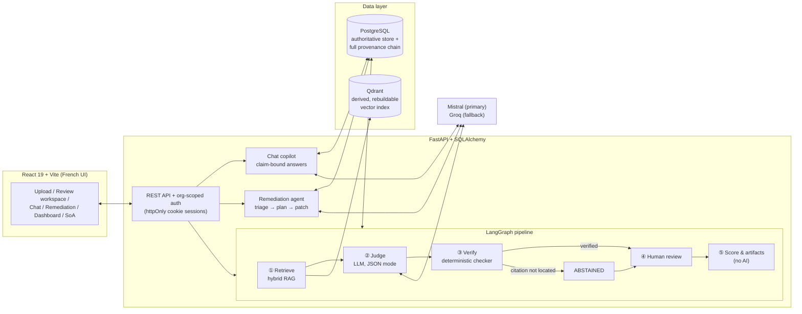

# ISO 42001 Conformity Platform

**An ISO/IEC 42001 compliance copilot with a verifiable trust layer — AI proposes, deterministic code and a human decide.**

[](https://github.com/Yassine511/ISO-42001-Conformity-Platform/actions/workflows/ci.yml)


[](LICENSE)

LLMs are good at reading policies and drafting compliance findings — and equally good at inventing
the evidence. This project takes the useful half and disarms the dangerous half:

- **Every citation is machine-verified.** A deterministic checker locates each quoted passage in the
  source document (exact match after normalization). A quote the checker cannot locate is never shown
  as evidence — the finding **abstains** instead.
- **Abstention is a first-class answer.** When the evidence isn't there, the system says so, with the
  retrieval trace, instead of guessing.
- **A human confirms every verdict.** AI output is a write-once draft; decisions live in an immutable
  review history. Scoring, the risk register, the SoA and the PDF report are computed only from
  human-confirmed findings — deterministically, with no AI in the loop.
- **Reliability is measured, not claimed.** A frozen gold dataset, a held-out test split, Wilson
  confidence intervals, and published raw counts — including the weak points.

Built end-to-end as the INT102 internship project at **Teamwill** (solo, ~11–13 weeks).
Full specification and design rationale: [Plan_Projet_INT102.md](Plan_Projet_INT102.md).

---

## What it does

| Capability | How the trust layer applies |
|---|---|
| **Assessment pipeline** — evaluates an organization's policy corpus against 65 paraphrased ISO 42001 requirements | LangGraph graph ① retrieve → ② judge (LLM, JSON mode) → ③ verify (deterministic citation + clause + schema checks; one bounded repair retry, then abstention) → ④ human review → ⑤ deterministic scoring |
| **Grounded chat copilot** — answers compliance questions with clickable footnote citations | Claim-level gating: a claim survives only if *every* citation it references verifies against the retrieved sources; the answer is assembled server-side from surviving claims. Unanswerable questions become explicit « Écart potentiel » abstention cards |
| **Remediation agent** — turns confirmed gaps into corrective-action plans | LLM-suggested / human-approved triage; plans gated by requirement binding and exact quote binding; per-action human review with mandatory priority; effectiveness checked by scoped re-assessments |
| **Document patching** — drafts policy amendments as anchored patches | Original uploads are immutable; patches anchor on a unique raw-equality quote, the human-edited text is the only text applied, and activation is a token-fenced two-phase protocol with full version lineage |
| **ISO artifacts** — conformity dashboard, AI risk register, Statement of Applicability, PDF report | All derived deterministically from human-confirmed findings under a versioned severity policy; the trust panel discloses gate counts and coverage |

Everything the auditor sees is a **server-derived source slice at persisted offsets** — never the
model's own quote string.

## Architecture



Design invariants the codebase enforces (and tests):

- **Provenance chain** — `documents → document_versions → pages → chunks`; every chunk stores
  `page_number, char_start, char_end` with the tested invariant
  `page_text[char_start:char_end] == chunk_text`. Citations resolve through these offsets.
- **PostgreSQL is authoritative; Qdrant is derived.** Indexing is a full reconciliation; search
  hydrates results from PostgreSQL and silently discards unknown points — an orphan vector can never
  surface. Retrieval is version-aware: one current-version snapshot per search, so rank fusion never
  mixes two corpus states.
- **Original uploads are immutable.** Agent output is a separate artifact or an explicitly activated
  new document version; superseded versions are never deleted, so past findings keep citing their
  exact text.
- **Full audit trail** — per-attempt LLM provenance, immutable review histories, append-only
  remediation and version event streams.

## Measured results (M6 evaluation)

Measured on the frozen corpus v1.2.0 (`m6-freeze` tag), held-out test split (n=14 requirements,
Wilson 95 % CIs, raw counts always published — protocol in
[eval/m6/rapport_m6.md](eval/m6/rapport_m6.md)):

| Metric | Result |
|---|---|
| Pipeline verdict accuracy vs gold | **9/14** (64.3 % [38.8; 83.7]) |
| Unsupported first-draft citations blocked by the verification gate | **3/14** |
| Unsupported citations displayed to the user | **0** — a structural invariant, checked empirically |
| Chat citation-location validity | **24/24** |
| Chat claim–citation semantic support precision (human-labelled) | 23/32 |
| Chat answer faithfulness | 7/10 FAITHFUL, **0 UNFAITHFUL** |

Weakest measured point (stated, not hidden): abstention recall on deliberately uncovered
requirements — the system asserts authentic-but-irrelevant citations instead of abstaining
(0/3 pipeline, 1/3 chat). Human review (M5) and the remediation loop (M7) are the designed
countermeasures. Dev diagnostics (n=51) are reported separately and never aggregated with holdout.

Retrieval exit gates (dev gold split, `scripts/retrieval_sanity.py`, strict six-document baseline):
doc recall@5 ≥ 0.85, evidence-anchor recall@5 ≥ 0.70, anchor recall@10 ≥ 0.85 — measured
**0.95 / 0.86 / 0.93** (hybrid) on corpus v1.2.0; KB scope R@5 = **0.96** (floor 0.60).

## The dataset

Real company documents were off-limits, so the corpus is itself an authored deliverable
([corpus/](corpus/README.md)): a 65-requirement **paraphrased** ISO 42001 knowledge base (French,
clauses 4–10 + Annex A), six policy documents of the fictional organization **Lumen AI** with
deliberately seeded gaps, and 65 gold labels (100 % KB coverage, dev/test split — the test split is
reserved for the M6 report, never for tuning). Eleven requirements are deliberately uncovered
corpus-wide: the correct system answer there is abstention.

The ISO/IEC 42001 text is copyrighted — the KB contains only paraphrases with clause references
(validator-enforced), never standard text.

## Quick start

```bash
git clone https://github.com/Yassine511/ISO-42001-Conformity-Platform.git
cd ISO-42001-Conformity-Platform
cp .env.example .env          # add MISTRAL_API_KEY (and optionally GROQ_API_KEY)
docker compose up --build -d
# Frontend : http://localhost:5173     API docs : http://localhost:8000/docs
```

Sign up (creates your user and organization), upload documents, index
(`POST /api/organizations/{id}/index` — first run downloads the ~220 MB embedding model), index the
KB (`POST /api/kb/index`), then launch an assessment from the UI.

### Local development

```bash
# services only
docker compose up -d postgres qdrant

# backend (http://localhost:8000; migrations run automatically at startup)
cd backend
python -m venv .venv && .venv\Scripts\pip install -r requirements-dev.txt
.venv\Scripts\uvicorn app.main:app --reload

# backend tests — 480+, no Docker/model/LLM needed
.venv\Scripts\python -m pytest -q

# frontend (http://localhost:5173, proxies /api)
cd ../frontend
npm install && npm run dev
npm run test                  # Vitest + Testing Library behaviour tests
```

### Configuration

Environment variables (see `backend/app/config.py`; the repo-root `.env` is picked up by Docker
Compose, `backend/.env` serves host-side CLI runs):

| Variable | Default | Purpose |
|----------|---------|---------|
| `DATABASE_URL` | local Postgres (host port 5433) | SQLAlchemy connection string |
| `QDRANT_URL` | `http://localhost:6333` | Vector store |
| `MISTRAL_API_KEY` | — | Primary LLM provider |
| `GROQ_API_KEY` | — | Fallback LLM provider |
| `SESSION_COOKIE_SECURE` | `false` | Set to `true` behind TLS (a warning is logged at startup while it is off) |
| `LLM_CALL_BUDGET_SECONDS` | `240` | Wall-clock ceiling for one provider call incl. its 429 retries; `0` disables |

Note: the PDF export needs WeasyPrint's native Pango/Cairo libraries — available in the Docker image
(CI-validated); on a bare Windows host venv the endpoint returns a clean 503.

### Deployment constraint: one worker per backend process

The backend **must run single-worker** (`uvicorn --workers 1`, set explicitly in
`backend/Dockerfile`). This is a design property, not an oversight: the assessment runner keeps its
thread and progress registries in process memory (`app/pipeline/runner.py`), the `resumable` flag
the UI uses to offer «Reprendre» is derived from them, and the `/api/kb/index` single-flight guard is
a process-local lock. A second worker would report wrong progress and offer resume on runs another
worker is actively executing. Correctness itself never depends on this — the DB partial unique index
(one RUNNING assessment per organization) and the org row locks are the real mechanisms — but the UI
would lie. Horizontal scaling means moving the runner onto a shared queue first.

Startup migrations are safe under concurrency regardless: `run_migrations()` holds a PostgreSQL
advisory lock, so a rolling deploy makes the second process wait rather than race on a revision.

## Repository map

```
backend/
  app/pipeline/      LangGraph assessment graph, citation verifier, run contract
  app/chat/          grounded chat copilot (claim-bound drafting)
  app/remediation/   remediation agent: triage, planner, actions, document patcher
  app/services/      retrieval (BM25 + vector + RRF), parsing, chunking, anchors,
                     checksums, scoring + versioned severity policy, SoA, PDF export
  app/eval/          M6 evaluation harness (scoring, gates, tamper-evident sheets)
  app/api/           REST routers + auth dependencies
  alembic/           20 migrations (run automatically at startup, under an advisory lock)
  tests/             480+ tests (offline by default: SQLite + fake embedder)
frontend/src/        React 19 pages, components, Vitest behaviour tests
corpus/              versioned KB + Lumen AI documents + gold labels (see corpus/README.md)
eval/                frozen M6 run artifacts + M7b anchor contract corpus
scripts/             CLI demos, eval runners, corpus validator, retrieval gates
```

## Assessment demo (CLI)

The pipeline is demoable without the frontend (services up, `MISTRAL_API_KEY` in `backend/.env`):

```bash
backend/.venv/Scripts/python scripts/assess_demo.py --org "Lumen AI" --requirement A.9.2  # → VERIFIED
backend/.venv/Scripts/python scripts/assess_demo.py --org "Lumen AI" --requirement A.4.5  # → ABSTAINED
backend/.venv/Scripts/python scripts/assess_demo.py --org "Lumen AI" --all-dev            # dev split
backend/.venv/Scripts/python scripts/assess_demo.py --org "Lumen AI" --assessment <id>    # resume a crashed run
```

`VERIFIED` means **citation/schema-verified** — the quote exists in the source at an exact match
after normalization (case, accents, whitespace, typographic quotes) — never "verdict proven correct"
(verdict accuracy is measured in M6; human review produces CONFIRMED). A near-match earns one repair
retry, then abstention with the offsets kept for priority human review.

## Authentication (M10)

Self-hosted email/password auth with org-scoped access. Signing up creates the user and their
organization; teammates join via single-use invite links (7-day expiry, no e-mail server needed).
Sessions are opaque tokens in an httpOnly `SameSite=Lax` cookie; the DB stores only `sha256(token)`
(no JWT, no signing secret). Every business route requires membership of the addressed organization
(404, never 403 — org existence is not leaked). Public: landing page, signup, login, invitation
lookup/accept, `/api/health`.

**Invitations work for existing accounts too.** The accept page branches on whether the invited
address already has one: if not, the link creates the account; if it does, the password *signs that
account in* and only adds the membership — which is how a user belongs to more than one
organization (signing up and creating an organization both mint a new one). Authentication happens
before any write, so a wrong password leaves the single-use link unconsumed.

**Members are manageable.** Any member can list members and pending invitations, remove a member
(including themselves — that's "leave"), and revoke an outstanding invite link. Every member has
equal rights by design: `organization_members` has no role column yet. Two rules the API enforces:
the **last** member can never be removed (there is no org-delete endpoint, so a zero-member
organization would be permanently unreachable data), and an **accepted** invitation is never
deleted — it is the record of how someone got access. Removal revokes no session; access ends at
the removed user's next request, because membership is checked per request.

Pre-M10 organizations have no members — attach an operator with
`python scripts/create_user.py --email you@x.fr --name "Vous" --org "Lumen AI"`.
Login answers in constant-ish time: an unknown address still runs one full bcrypt verification
against a fixed dummy hash, so the identical 401 is not a timing oracle. Expired session rows are
pruned opportunistically (on presentation, and for the user at each new login) rather than by a cron
job — expiry is absolute, so an expired row can never authenticate again either way.

**Rate limiting** is in place on every endpoint that checks a password or discloses account
existence: `/api/auth/login`, the existing-account branch of `/api/auth/invitations/{token}/accept`,
and `/api/auth/signup`. Fixed windows keyed on `(e-mail, client IP)` — hashed, so the limiter is not
itself a list of typed addresses — in process memory, consistent with the single-worker deployment.
A successful login forgets its window, and the limiter fails open on its own errors: it protects an
endpoint, it must never be the reason nobody can log in.

This bounds, but does not remove, the **account-existence disclosure**: with no e-mail server signup
must either create the account or refuse, so its 409 necessarily reveals that an address is taken.
The message is deliberately *not* degraded — a vague error would cost every legitimate user clarity
to buy an attacker nothing they cannot already get from the login form.

Pre-production TODOs (documented, deliberately out of scope):

- **Password reset** (needs e-mail infrastructure).
- **CSRF double-submit** hardening (today's defence is `SameSite=Lax` on a same-origin deployment).
- **Authorization roles.** `POST /api/kb/index` rebuilds shared knowledge-base vectors and any
  authenticated user can call it; it is now single-flight (a concurrent call gets 409) so it cannot
  be spammed into interleaved reconciliations, but "operator only" needs the role column
  `organization_members` deliberately does not have yet.

## Testing & CI

- **Backend** — 480+ pytest tests, offline by default (SQLite + injected fake embedder + in-memory
  Qdrant); CI adds a live Postgres service so the migration-chain and checkpointer tests run for real.
  Includes adversarial suites: planted fake quotes, injected instructions in documents, fabricated
  anchors, stale-state races.
- **Frontend** — 89 Vitest + Testing Library behaviour tests, plus `tsc` and a production build in CI.
- **Docker PDF job** — builds the backend image and renders a real PDF inside it (the authoritative
  native-library check).
- **Dependency audit** — `npm run audit:gate` fails on any high/critical advisory except ones
  documented in `frontend/scripts/audit-gate.mjs` with a reason and a review date. It also fails on
  an *expired* or *stale* exception, so a documented exception cannot quietly become permanent.
  One is live: react-router's RSC-mode CSRF advisory has no published fix (it lands in a version 8
  that does not exist) and does not apply to this client-only SPA — and npm's suggested "fix",
  downgrading to 7.11.0, would reintroduce the open-redirect advisories that *do* affect
  `<Link>`/`useNavigate`.
- **Out of CI, by design** — retrieval quality gates (`scripts/retrieval_sanity.py`) need the live
  embedding model + indexed baseline; corpus consistency (`scripts/validate_corpus.py`) also runs
  under pytest.

## Milestones

| Milestone | Deliverable | Status |
|---|---|---|
| M1a / M1b | Foundation (upload, parsing, provenance) + authored French corpus & gold labels | ✅ |
| M2 | Hybrid RAG: French-analyzer BM25 + multilingual vectors + RRF, versioned Qdrant collection | ✅ |
| M3 | Pipeline core: judge / verify / repair-retry / abstain, per-attempt provenance | ✅ |
| M4 | Grounded chat copilot with claim-level citation gating | ✅ |
| M5 | Frontend + human-in-the-loop review workspace (write-once drafts, immutable reviews) | ✅ |
| M6 | Evaluation: frozen contracts, sealed holdout run, published report | ✅ |
| M7a | Remediation planning agent (triage → verified plans → per-action review → effectiveness) | ✅ |
| M7b | Document-editing tool: anchored patches, immutable originals, versioned activation | ✅ |
| M8 | Scoring & artifacts: dashboard, trust panel, risk register, SoA, PDF export | ✅ |
| M9 | Deliverables: README, architecture, internship report, defense | ✅ |
| M10 | SaaS-readiness: organization auth + public landing page | ✅ |

## Commit convention

```
<Mx> <area>: <imperative summary>
```

`Mx` = milestone tag (omitted for cross-cutting fixes); `area` ∈ `backend | frontend | infra |
corpus | eval | docs`; summary in the imperative mood, ≤ 72 characters. Commits older than the
M7a/M7b introduction use the pre-renumbering `M7`/`M8` meanings.

---

*User-facing text (UI, API messages, corpus, reports) is French; code, comments and commits are
English. INT102 internship project — Teamwill.*
